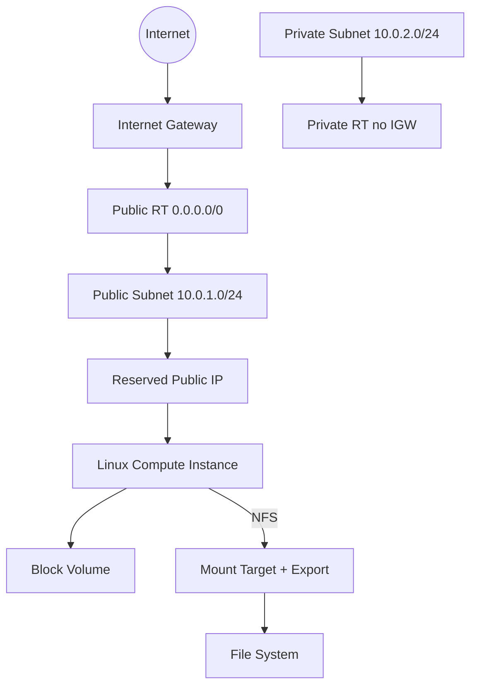

# Ejada Cloud Build 2026 — Week 1 OCI Foundations (Terraform)

**Author:** Salah Abdelhady  
**Program:** Egypt Summer Internship Program 2026 — Cloud Build (OCI & Terraform)  
**Scope of this repo:** Professional **README + Terraform modules + environment stack** only  
(Console screenshots and full lab write-ups stay local; this is the portfolio-ready IaC deliverable.)

## What it deploys

In a single environment stack (`nonprd/week1-foundations`):

| Resource | Name pattern | Notes |
|----------|--------------|--------|
| VCN | `w1-vcn` | `10.0.0.0/16` |
| Internet Gateway | `w1-igw` | Public internet path |
| Route tables | `w1-public-rt` / `w1-private-rt` | Public: `0.0.0.0/0` → IGW (**on the subnet RT only**) |
| Security lists | `w1-public-sl` / `w1-private-sl` | SSH locked to your `/32` |
| Public subnet | `w1-public-subnet` | `10.0.1.0/24` |
| Private subnet | `w1-private-subnet` | `10.0.2.0/24` (no public IPs) |
| Compute | `w1-linux-vm` | Oracle Linux, Flex shape |
| **Reserved public IP** | `w1-reserved-pip` | `lifetime = RESERVED` (extra lab feature) |
| Block volume | `w1-block-vol` | Attached (paravirtualized), format/mount on OS |
| File Storage (optional) | `w1-fss` + MT + export | Flag `enable_file_storage` |

Tags: `Project=Ejada-Cloud-Build`, `Lab=week1-lab1`, `ManagedBy=Terraform`.

## Architecture



## Azure ↔ OCI (quick map)

| Azure | OCI |
|-------|-----|
| Resource Group | Compartment |
| VNet / Subnet | VCN / Subnet |
| NSG | Security List / NSG |
| VM | Compute Instance |
| Static Public IP | Reserved Public IP |
| Managed Disk | Block Volume |
| Azure Files (NFS) | File Storage + Mount Target |
| ACR / AKS | OCIR / OKE (later weeks) |

## Repo layout (Belal-style)

```
.
├── README.md
├── .gitignore
└── terraform/
    ├── modules/
    │   ├── oracle-vcn/
    │   ├── oracle-internet-gateway/
    │   ├── oracle-route-table/
    │   ├── oracle-security-list/
    │   ├── oracle-subnet/
    │   ├── oracle-instance/
    │   ├── oracle-block-volume/
    │   ├── oracle-file-system/
    │   └── oracle-public-ip/          # RESERVED public IP
    └── nonprd/
        └── week1-foundations/         # root module (env assembly)
            ├── providers.tf
            ├── versions.tf
            ├── variables.tf
            ├── locals.tf
            ├── data.tf
            ├── network.tf
            ├── compute.tf
            ├── storage.tf
            ├── outputs.tf
            └── terraform.tfvars.example
```

**Why this split:** modules are reusable building blocks; `week1-foundations` is the environment that wires them with variables — same idea as enterprise multi-env Terraform (and Belal’s pattern).

## Extra feature: reserved public IP

- Instance VNIC is created with **`assign_public_ip = false`** when `use_reserved_public_ip = true`.
- Module `oracle-public-ip` creates `oci_core_public_ip` with **`lifetime = "RESERVED"`** and attaches it to the instance primary private IP.
- **Azure analogy:** Static / Standard Public IP.

```hcl
use_reserved_public_ip = true   # default recommended for this lab
```

## Prerequisites

1. OCI tenancy + compartment OCID (internship compartment)
2. [OCI CLI](https://docs.oracle.com/en-us/iaas/Content/API/SDKDocs/cliinstall.htm) configured (`~/.oci/config`, profile e.g. `DEFAULT`)
3. [Terraform](https://developer.hashicorp.com/terraform/install) >= 1.5
4. SSH key pair (public key goes into `terraform.tfvars`)

## Usage

```bash
cd terraform/nonprd/week1-foundations

cp terraform.tfvars.example terraform.tfvars
# Edit terraform.tfvars:
#   compartment_ocid
#   ssh_public_key          (one line from .pub)
#   allowed_ssh_cidr       (YOUR_PUBLIC_IP/32)
#   use_reserved_public_ip = true
#   enable_file_storage    = true   # set false if MT quota is exhausted

terraform init
terraform fmt
terraform validate
terraform plan -out=tfplan
terraform apply tfplan

terraform output
# instance_public_ip / reserved_public_ip / ssh_hint
```

SSH:

```bash
ssh -i /path/to/private_key opc@PUBLIC_IP
```

Then on the VM: format/mount block volume (`lsblk` → `mkfs`/`mount` on data disk only).  
For FSS: mount NFS using Mount Target private IP + export path from outputs/Console (ensure SL allows NFS ports 111 / 2048–2050 / 2049 as needed).

### Cleanup (required for lab credit hygiene)

```bash
terraform destroy
```

## Security notes

- **Never commit** `terraform.tfvars`, `*.pem`, or `*.tfstate*`.
- Prefer SSH from **your IP `/32`**, not `0.0.0.0/0`.
- Do **not** associate a subnet route table with the Internet Gateway as a “gateway route table” (OCI footgun: only private-IP-style targets there).

## Lab results (reference run)

Evidence from a successful internship apply (then destroy):

| Metric | Value |
|--------|--------|
| Plan / apply | **15 resources added** |
| Destroy | **15 resources destroyed** |
| Example reserved public IP (historical) | `144.24.210.184` (will differ per apply) |
| Example private IP | `10.0.1.90` |
| Export path | `/export` |

## License / use

Educational portfolio for Ejada Cloud Build Internship 2026. Deploy only in **your** designated compartment.
