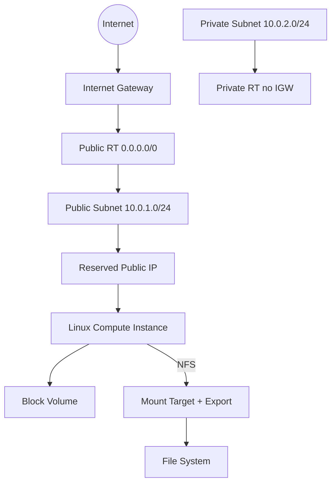
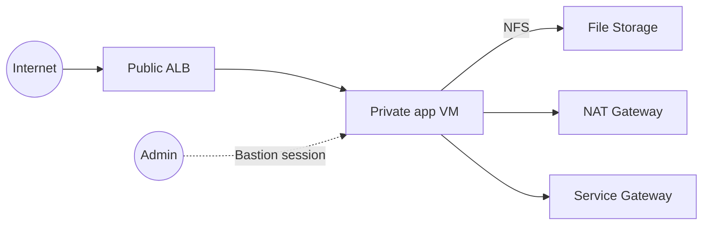
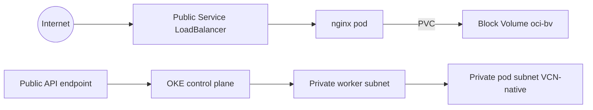

# Ejada Cloud Build 2026 — OCI Terraform

**Author:** Salah Abdelhady

Portfolio for Oracle Cloud Infrastructure (OCI) from the Ejada Cloud Build program:

| Path | Contents |
|------|----------|
| [`terraform/`](terraform/) | Infrastructure as Code (IaC) per week |
| [`week1/`](week1/) | Week 1 lab submission documentation (PDF) |
| [`week2/`](week2/) | Week 2 lab submission documentation (PDF) + architecture diagram |
| [`week3/`](week3/) | Week 3 lab docs: Terraform write-up, architecture diagrams, modules reference PDF + module diagrams |

Four non-production Terraform stacks live under `terraform/nonprd/` (three labs plus a one-time remote-state bootstrap).

## Environments

| Path | Lab | Style |
|------|-----|--------|
| [`terraform/nonprd/week1-foundations/`](terraform/nonprd/week1-foundations/) | Week 1 — compute, networking, block/FSS | Root module + shared `terraform/modules/*` |
| [`terraform/nonprd/week2-lb-fss/`](terraform/nonprd/week2-lb-fss/) | Week 2 — public ALB, private app, FSS | Nested **cohesive** modules (`network`, `compute`, `storage`, `lb`); compute uses `for_each` over an `instances` map |
| [`terraform/nonprd/week3-containerized-oke/`](terraform/nonprd/week3-containerized-oke/) | Week 3 — OKE, VCN-native CNI, kubectl workload | Nested **cohesive** modules (`network`, `subnet`, `oke`); OKE NSGs use `for_each` |
| [`terraform/nonprd/bootstrap-state/`](terraform/nonprd/bootstrap-state/) | Remote state bucket (Object Storage) | One-time bootstrap; keeps **local** state itself |

Each lab stack is self-contained: copy its own `terraform.tfvars.example` → `terraform.tfvars`, then `init` / `plan` / `apply` from that directory. Week 2 and Week 3 also ship `backend.tf` + `backend.hcl.example` for optional remote state on OCI Object Storage (S3-compatible API) — see [terraform/README.md](terraform/README.md#remote-state-planned) after applying `bootstrap-state` once.

## Design principles (mentor feedback)

- **Variables first** — display names, shapes, CIDRs, ports, counts, and feature flags come from variables; real values live in **gitignored** `terraform.tfvars`.
- **Ship only examples** — commit `terraform.tfvars.example` with placeholders; never real tenancy/compartment OCIDs, keys, or API PEM paths.
- **Modules for related groups** — wrap cohesive building blocks (e.g. VCN+gateways+RTs+SLs+NSGs+subnets, FSS+MT+export, LB+backends+listener). **Do not** use thin one-resource modules (IGW alone, public IP alone). **Do not** leave a whole lab as flat root `oci_*` only when clear groups exist.
- **Readable root** — multi-file root (`network.tf`, `compute.tf`, …) that **calls** those modules; use `count` / conditionals openly. Single standalone resources (e.g. Bastion) may stay at root.

## Week 1 — Foundations

Environment stack `nonprd/week1-foundations`:

| Resource | Name pattern | Notes |
|----------|--------------|--------|
| VCN | `w1-vcn` | `10.0.0.0/16` |
| Internet Gateway | `w1-igw` | Public internet path |
| Route tables | `w1-public-rt` / `w1-private-rt` | Public: `0.0.0.0/0` → IGW (on the **subnet** RT) |
| Security lists | `w1-public-sl` / `w1-private-sl` | SSH locked to your `/32` |
| Public subnet | `w1-public-subnet` | `10.0.1.0/24` |
| Private subnet | `w1-private-subnet` | `10.0.2.0/24` (no public IPs) |
| Compute | `w1-linux-vm` | Oracle Linux, Flex shape |
| Reserved public IP | `w1-reserved-pip` | `lifetime = RESERVED` |
| Block volume | `w1-block-vol` | Attached (paravirtualized); format/mount on OS |
| File Storage (optional) | `w1-fss` + MT + export | Flag `enable_file_storage` |

Tags: `Project=Ejada-Cloud-Build`, `Lab=week1-lab1`, `ManagedBy=Terraform`.

### Week 1 architecture



### Reserved public IP (Week 1)

- Instance VNIC uses **`assign_public_ip = false`** when `use_reserved_public_ip = true`.
- Module `oracle-public-ip` creates `oci_core_public_ip` with **`lifetime = "RESERVED"`** and attaches it to the instance primary private IP.

## Week 2 — Load balancer + File Storage

Environment stack `nonprd/week2-lb-fss` (CIDR example `10.1.0.0/16` — set in tfvars):

| Layer | What it deploys |
|-------|-----------------|
| Network module | VCN, public + private subnets, **IGW**, **NAT**, **Service Gateway (SGW)**, route tables, security lists, **NSGs** |
| Compute module | Private app instance (no public IP); cloud-init mounts FSS and serves HTTP; optional jump |
| Storage module | File system + mount target (private) + export (e.g. `/export`) |
| LB module | Flexible **public** Application LB → private backend `:80`; health check `/` |
| Access | **OCI Bastion** at root (`enable_bastion`; may need IAM `manage bastion-family`); optional public jump (`enable_jump`, default `false`) |

Week 2 modules are nested under the stack (`terraform/nonprd/week2-lb-fss/modules/`) so Week 1 shared modules stay untouched. See the stack [README](terraform/nonprd/week2-lb-fss/README.md). Lab PDFs: [`week2/`](week2/).

### Week 2 data path (brief)



## Week 3 — Containerized application / OKE

Environment stack `nonprd/week3-containerized-oke` (CIDR example `10.2.0.0/16` — set in tfvars):

| Layer | What it deploys |
|-------|-----------------|
| Network module | VCN, **IGW**, **NAT**, **Service Gateway (SGW)**, shared VCN flow-log group |
| Subnet module | `for_each` lb (public, IGW), workers (private, NAT), pods (private, NAT, `/18` for VCN-native CNI) + RT + SL + optional logs |
| OKE module | BASIC cluster, **OCI_VCN_IP_NATIVE**, managed node pool, cluster NSGs (count = `enable_oke`) |
| Workload | `k8s/` nginx Deployment + PVC (`oci-bv` block volume) + LoadBalancer Service — applied with kubectl after the cluster is ACTIVE |

Stage A: `enable_oke = false` (network + lb flow logs). Stage B: `enable_oke = true` (cluster + node pool). Destroy the same session after the demo.

Week 3 modules are nested under the stack (`terraform/nonprd/week3-containerized-oke/modules/`). See the stack [README](terraform/nonprd/week3-containerized-oke/README.md). Lab deliverables: [`week3/`](week3/).

### Week 3 data path (brief)



## Lab documentation

| Lab | File |
|-----|------|
| Week 1 | [week1/Week1-Lab1-OCI-Compute-Storage-Deployment-Console-and-Terraform.pdf](week1/Week1-Lab1-OCI-Compute-Storage-Deployment-Console-and-Terraform.pdf) |
| Week 2 submission | [week2/WEEK2-LAB2-Ejada-Submission.pdf](week2/WEEK2-LAB2-Ejada-Submission.pdf) |
| Week 2 architecture | [week2/week2-lab2-architecture_1.drawio](week2/week2-lab2-architecture_1.drawio) |
| Week 3 Terraform documentation | [week3/Week3-Lab3-Terraform-Documentation.pdf](week3/Week3-Lab3-Terraform-Documentation.pdf) — full Terraform lab write-up (architecture, commands, evidence, screenshots) |
| Week 3 architecture diagrams | [week3/Week3-Terraform-Diagrams.drawio](week3/Week3-Terraform-Diagrams.drawio) — architecture / traffic / topology diagrams for the Terraform lab |
| Week 3 modules reference | [week3/Week3-Terraform-Modules-Reference.pdf](week3/Week3-Terraform-Modules-Reference.pdf) — detailed reference for each module (network, subnet, oke): every file, purpose, inputs, outputs |
| Week 3 module diagrams | [week3/Week3-Modules-Diagrams2.drawio](week3/Week3-Modules-Diagrams2.drawio) — module-map / module diagrams companion to the modules reference |

## Project structure

```
.
├── README.md
├── .gitignore
├── week1/
│   └── Week1-Lab1-OCI-Compute-Storage-Deployment-Console-and-Terraform.pdf
├── week2/
│   ├── README.md
│   ├── WEEK2-LAB2-Ejada-Submission.pdf
│   └── week2-lab2-architecture_1.drawio
├── week3/
│   ├── README.md
│   ├── Week3-Lab3-Terraform-Documentation.pdf
│   ├── Week3-Terraform-Diagrams.drawio
│   ├── Week3-Terraform-Modules-Reference.pdf
│   └── Week3-Modules-Diagrams2.drawio
└── terraform/
    ├── modules/                    # Shared building blocks (Week 1)
    │   ├── oracle-vcn/
    │   ├── oracle-internet-gateway/
    │   ├── oracle-route-table/
    │   ├── oracle-security-list/
    │   ├── oracle-subnet/
    │   ├── oracle-instance/
    │   ├── oracle-block-volume/
    │   ├── oracle-file-system/
    │   └── oracle-public-ip/       # RESERVED public IP
    ├── README.md                   # Remote state + stack index
    └── nonprd/
        ├── bootstrap-state/        # One-time Object Storage bucket for remote state
        ├── week1-foundations/      # Week 1 root (uses terraform/modules)
        ├── week2-lb-fss/           # Week 2 root + nested cohesive modules
        │   └── modules/
        │       ├── network/
        │       ├── compute/
        │       ├── storage/
        │       └── lb/
        └── week3-containerized-oke/  # Week 3 root + nested cohesive modules
            ├── k8s/
            └── modules/
                ├── network/
                ├── subnet/
                └── oke/
```

## Prerequisites

1. OCI tenancy + compartment OCID (or rights to create in one)
2. [OCI CLI](https://docs.oracle.com/en-us/iaas/Content/API/SDKDocs/cliinstall.htm) configured (`~/.oci/config`, profile e.g. `DEFAULT`)
3. [Terraform](https://developer.hashicorp.com/terraform/install) `>= 1.5`
4. SSH key pair (public key line goes into `terraform.tfvars`)

## Clone and use

```bash
git clone https://github.com/Salahmohameds/ejada-oci-week1-terraform.git
cd ejada-oci-week1-terraform
```

### Week 1

```bash
cd terraform/nonprd/week1-foundations

cp terraform.tfvars.example terraform.tfvars
# Edit: compartment_ocid, ssh_public_key, allowed_ssh_cidr (YOUR_IP/32)
# use_reserved_public_ip = true
# enable_file_storage    = true   # or false if FSS/MT quota is exhausted

terraform init
terraform fmt
terraform validate
terraform plan -out=tfplan
terraform apply tfplan
terraform output
```

SSH:

```bash
ssh -i /path/to/private_key opc@PUBLIC_IP
```

Then format/mount the data block volume on the OS if needed; mount FSS via mount-target private IP + export from outputs when enabled.

### Week 2

```bash
cd terraform/nonprd/week2-lb-fss

cp terraform.tfvars.example terraform.tfvars
# Edit: compartment_ocid, ssh_public_key, allowed_ssh_cidr
# enable_bastion / enable_nsgs / enable_service_gateway as needed

terraform init
terraform fmt -recursive
terraform validate
terraform plan -out=tfplan
terraform apply tfplan

# After cloud-init (a few minutes):
curl "http://$(terraform output -raw lb_public_ip)/"
```

Bastion create needs sufficient IAM (e.g. `manage bastion-family`). If create returns 404 or authorization errors, fix policy or set `enable_bastion = false` / use `enable_jump = true` for a lab-only public jump host. Stack networking (NSG, SGW, ALB, FSS) remains valid either way.

### Week 3

```bash
cd terraform/nonprd/week3-containerized-oke

cp terraform.tfvars.example terraform.tfvars
# Edit: compartment_ocid, ssh_public_key, allowed_ssh_cidr
# Stage A: enable_oke = false
# Stage B: enable_oke = true  (cluster + node; destroy the same day)

terraform init
terraform fmt -recursive
terraform validate
terraform plan -out=tfplan
terraform apply tfplan

# After the cluster is ACTIVE: write kubeconfig, then:
kubectl apply -f k8s/namespace.yaml
kubectl apply -f k8s/storageclass.yaml
kubectl apply -f k8s/pvc.yaml
kubectl apply -f k8s/deployment.yaml
kubectl apply -f k8s/service.yaml
```

OKE and a Service LoadBalancer incur cost. Delete the Service and PVC **before** `terraform destroy`.

### Cleanup (any stack)

```bash
terraform destroy
```

## Security notes

- **Never commit** `terraform.tfvars`, `backend.hcl`, `*.pem`, Customer Secret Keys, or `*.tfstate*`.
- Prefer SSH / Bastion client allow-lists from **your IP `/32`**, not `0.0.0.0/0`.
- Do **not** use the Internet Gateway as a “gateway route table” target incorrectly (subnet route tables only for `0.0.0.0/0` → IGW).
- Destroy stacks when the lab is done to avoid unused resource cost.

## License / use

Educational portfolio for Ejada Cloud Build 2026. Deploy only in **your** designated compartment.
