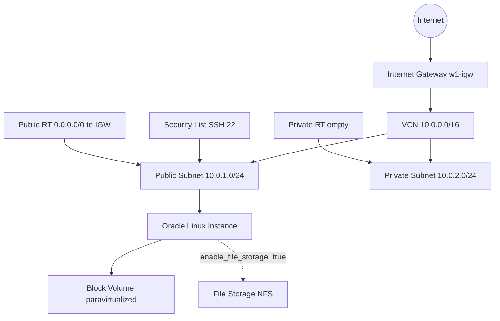

# Week 1 Foundations — Terraform stack (OCI)

**Program:** Ejada Egypt Summer Internship 2026 — Cloud Build  
**Track:** OCI & Terraform  
**Maps to:** [Week 1 Lab 1 — OCI Console](../../../labs/week1-lab1-oci-console/README.md)

This root stack assembles reusable modules under `terraform/modules/` into a **non-production** landing environment matching Lab 1: VCN, IGW, public/private subnets, SSH security list, Oracle Linux VM with public IP, block volume (paravirtualized attach). **File Storage is optional** and **off by default** because mount-target quota often blocks training tenancies.

---

## Architecture



### OCI ↔ Azure mapping

| OCI | Azure |
|-----|--------|
| Compartment | Resource Group |
| VCN | Virtual Network |
| Subnet (public / private) | Subnet |
| Internet Gateway | Internet / NAT Gateway patterns |
| Route table (subnet) | Route table |
| Security List | Network Security Group |
| Compute instance | Virtual Machine |
| Reserved public IP (`lifetime = RESERVED`) | Static Public IP / Standard PIP |
| Ephemeral public IP | Dynamic public IP |
| Block volume | Managed Disk |
| File Storage (FSS) | Azure Files (NFS-like) |
| Availability Domain | Availability Zone |

### IGW route-table footgun

Public egress is **only** via the **subnet route table** rule `0.0.0.0/0 → Internet Gateway`.

Do **not** attach a route table to the Internet Gateway itself for this design. Gateway-level route tables are a separate advanced feature; using them here confuses console learners and does not match the Lab 1 mental model.

---

## Layout (Belal-style)

```
terraform/
  modules/                     # reusable, no env OCIDs
    oracle-vcn/
    oracle-internet-gateway/
    oracle-route-table/
    oracle-security-list/
    oracle-subnet/
    oracle-instance/
    oracle-public-ip/
    oracle-block-volume/
    oracle-file-system/
  nonprd/
    week1-foundations/         # THIS STACK
```

Modules contain **no** `provider` blocks. Auth and region live in this environment root only.

---

## Prerequisites

1. [Terraform](https://developer.hashicorp.com/terraform/install) >= 1.5  
2. OCI CLI config working (`oci iam region list` with profile `DEFAULT`) **or** API key vars  
3. Compartment OCID for your intern sandbox  
4. SSH key pair (public key for the instance)

### Auth — preferred (config profile)

```hcl
provider "oci" {
  region              = var.region
  config_file_profile = var.config_file_profile  # DEFAULT
}
```

Uses `~/.oci/config` (or `%USERPROFILE%\.oci\config` on Windows). No PEM path in committed files.

### Auth — explicit API key (optional)

Set in **local** `terraform.tfvars` only:

- `tenancy_ocid`, `user_ocid`, `fingerprint`, `private_key_path`

Never commit real OCIDs, fingerprints, or `.pem` files.

---

## Deploy steps

From this directory:

```bash
cd terraform/nonprd/week1-foundations

# 1. Create local vars from the example (gitignored)
cp terraform.tfvars.example terraform.tfvars
# Edit terraform.tfvars:
#   - compartment_ocid
#   - allowed_ssh_cidr  (prefer YOUR_IP/32; 0.0.0.0/0 is NOT production)
#   - ssh_public_key    (public key line only)

# 2. Init + format + validate
terraform init
terraform fmt -recursive ../..
terraform validate

# 3. Plan / apply
terraform plan
terraform apply
```

Expected named resources with `name_prefix = "w1"`:

| Resource | Name |
|----------|------|
| VCN | `w1-vcn` |
| IGW | `w1-igw` |
| Public RT | `w1-public-rt` |
| Private RT | `w1-private-rt` |
| Subnets | `w1-public-subnet`, `w1-private-subnet` |
| Instance | `w1-linux-vm` |
| Reserved public IP | `w1-reserved-pip` (when `use_reserved_public_ip = true`) |
| Block volume | `w1-block-vol` |

Freeform tags on resources:

- `Project=Ejada-Cloud-Build`
- `Lab=week1-lab1`
- `ManagedBy=Terraform`

---

## Validation checklist

After apply:

1. `terraform output instance_public_ip` returns an IP.  
2. SSH: `ssh -i <private-key> opc@<public_ip>`  
3. Console / CLI: VCN `10.0.0.0/16`, public `10.0.1.0/24`, private `10.0.2.0/24`  
4. Public RT has `0.0.0.0/0` → IGW; private RT has **no** IGW route  
5. Security list: TCP 22 from `allowed_ssh_cidr`  
6. Block volume attached (paravirtualized); format/mount on the OS if required for lab screenshots  
7. (Optional) FSS only if `enable_file_storage = true` and quota allows  

Capacity notes: apply may fail if the tenancy has no free VM shapes or image listing returns empty for the chosen shape — change `instance_shape` / AD index as mentors advise. That is OK for planning practice.

---

## Reserved Public IP

**Azure equivalent:** Static Public IP / Standard Public IP (PIP).

OCI distinguishes **ephemeral** (tied to the VNIC create flag, released when the instance stops/terminates depending on settings) from **reserved** (standalone `oci_core_public_ip` with `lifetime = "RESERVED"`, assigned to a private IP on the VNIC).

| Setting | Behavior |
|---------|----------|
| `use_reserved_public_ip = true` (default) | Instance VNIC has `assign_public_ip = false`; module `oracle-public-ip` creates a RESERVED IP and attaches it to the primary private IP |
| `use_reserved_public_ip = false` | Classic ephemeral path via `instance_assign_public_ip` |

```hcl
# terraform.tfvars
use_reserved_public_ip    = true  # recommended for a stable public address
instance_assign_public_ip = true  # ignored when reserved path is on
```

After apply:

- `terraform output reserved_public_ip` → the static address  
- `terraform output instance_public_ip` → coalesces reserved or ephemeral  

SSH using that address: `ssh -i <key> opc@<instance_public_ip>`.

---

## File Storage (`enable_file_storage`)

| Setting | Behavior |
|---------|----------|
| `false` (default) | No FS / mount target / export — **use this until quota is free** |
| `true` | Creates `w1-fss`, mount target, export `/export` in the public subnet |

Console Lab 1 already hit **mount-target-count** limits. Keep FSS off unless mentors confirm available quota.

---

## Destroy / cleanup

Protect shared internship credits:

```bash
terraform destroy
```

Confirm instance, volumes, and network objects are gone in the console afterward.

---

## Relation to console lab

| Console step | Terraform |
|--------------|-----------|
| Create VCN / IGW / RT / SL / subnets | `network.tf` modules |
| Launch Oracle Linux + public IP | `compute.tf` → `oracle-instance` (+ `oracle-public-ip` when reserved) |
| Create + attach block volume | `storage.tf` → `oracle-block-volume` |
| File system + mount target | `storage.tf` → `oracle-file-system` when enabled |

This stack is infrastructure-as-code for the same design you built by hand; use it to practice plan/apply/destroy instead of re-clicking the console.

---

## Outputs

Key outputs: `vcn_id`, `public_subnet_id`, `private_subnet_id`, `instance_id`, `instance_public_ip`, `reserved_public_ip`, `block_volume_id`, optional `file_system_id` / `mount_target_id`, `ssh_hint`.
